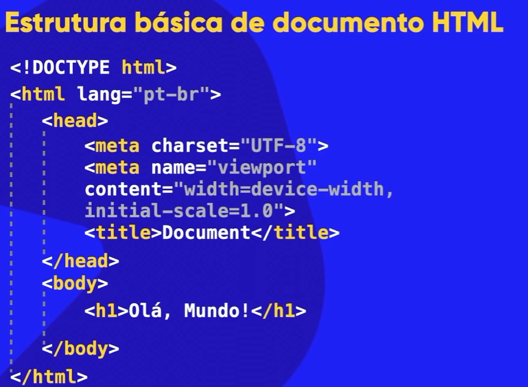

# HTML

<details>
<summary><strong>Estrutura básica de documento HTML</strong></summary>



</details>

<details>
<summary><strong>&lt;h1&gt; - Definir o Título Principal de uma Página</strong></summary>

(VAI ATE O <h6>)

Vamos ao básico, do jeito que sempre funcionou — e ainda funciona 😉

Em HTML, a tag `<h1>` é usada para **definir o título principal de uma página**. Pense nela como a manchete de um jornal antigo: é a primeira coisa que chama atenção e diz claramente sobre o que se trata o conteúdo.

### O que é exatamente o `<h1>`?

- O **“h” vem de *heading*** (cabeçalho ou título)
- O **número 1 indica o nível mais importante**
- É o **título de maior destaque** dentro de uma página

Exemplo simples:

```html
<h1>Bem-vindo ao meu site</h1>

```

### Para que serve na prática?

Tradicionalmente — e isso é algo que veio lá dos primórdios da web — o `<h1>` tem três papéis fundamentais:

1. **Organização do conteúdo**

    Ele diz: “este é o assunto principal daqui”. Assim como capítulos em um livro bem-feito.

2. **Acessibilidade**

    Leitores de tela usam o `<h1>` para entender rapidamente o tema da página. É respeito com todos os usuários.

3. **SEO (Google e afins)**

    Os mecanismos de busca dão mais peso ao `<h1>`. Usar bem essa tag é como colocar o letreiro certo na fachada da loja.


### Uma boa prática clássica

Durante muitos anos, a regra de ouro foi:

> Uma página, um <h1>
>

Hoje, o HTML5 até permite mais de um em certos contextos, mas a tradição ainda é sólida: **um `<h1>` claro, direto e bem pensado costuma dar melhores resultados**. O simples bem-feito quase sempre vence.

### E os outros títulos?

Depois do `<h1>`, vêm:

- `<h2>` → subtítulos
- `<h3>` → subtópicos
- … até `<h6>`

Tudo em ordem, como uma hierarquia bem construída — do geral para o específico.

### Em resumo

O `<h1>`:

- É o **título principal da página**
- Deve representar o **assunto central**
- Ajuda usuários, leitores de tela e buscadores
- É um pilar antigo da web que continua atual

Se quiser, posso te mostrar **bons e maus exemplos de uso do `<h1>`** ou montar uma página simples do zero para você enxergar isso funcionando de verdade.

</details>

<details>
<summary><strong>&lt;h2&gt; - Título de Segundo Nível</strong></summary>

(VAI ATE O <h6>)

Vamos pelo caminho clássico, do jeito que sempre funcionou, mas com um olhar pra frente. 😊

Em **HTML**, a tag **`<h2>`** é usada para definir um **título de segundo nível** em uma página.

### Pensando como nos bons tempos 📚

Desde o começo da web, os títulos seguem uma hierarquia, quase como um livro bem organizado:

- `<h1>` → título principal (o mais importante)
- `<h2>` → subtítulo
- `<h3>` → subtítulo do subtítulo
- … e assim vai até `<h6>`

Ou seja, o **`<h2>` vem logo abaixo do `<h1>`**. Ele serve para dividir o conteúdo em seções importantes, mas que ainda fazem parte do tema principal.

### Exemplo simples

```html
<h1>Aprendendo HTML</h1>
<h2>O que é HTML?</h2>
<p>HTML é a linguagem usada para criar páginas web.</p>

```

Nesse exemplo:

- `<h1>` apresenta o assunto geral da página.
- `<h2>` introduz um tópico específico dentro desse assunto.

### Por que isso é importante? (aqui entra a visão visionária 🔮)

Usar corretamente o `<h2>` não é só estética:

- 🧠 **Ajuda os leitores** a entenderem a estrutura do texto
- 🔍 **Melhora o SEO**, facilitando a vida dos buscadores
- ♿ **Aumenta a acessibilidade**, permitindo que leitores de tela naveguem melhor pelo conteúdo

### Regra de ouro da velha escola

Nunca use `<h2>` só para “aumentar o texto”. Ele **não é estilo**, é **significado**. Para estilo, usamos CSS — como manda o figurino desde sempre.

Resumindo:

👉 **`<h2>` é um título secundário que organiza o conteúdo e dá sentido à página.**

Se quiser, posso te mostrar como combinar `<h2>` com CSS do jeito certo, sem quebrar as boas práticas.

</details>

<details>
<summary><strong>&lt;h3&gt; - Títulos e Subtítulos H2</strong></summary>

(VAI ATE O <h6>)

Boa pergunta — e ótima pra quem está começando do jeito certo, com o pé no chão. Vamos lá, sem complicar.

Em HTML, a tag `<h3>` é usada para **títulos e subtítulos**. Ela faz parte da família das *heading tags*, que vão de `<h1>` até `<h6>`.

Pensa como se fosse a hierarquia de um livro, bem do jeito que sempre foi feito no papel:

- `<h1>` → título principal (o nome do capítulo, o mais importante)
- `<h2>` → subtítulo do capítulo
- **`<h3>` → subtítulo do subtítulo**
- `<h4>` em diante → divisões ainda menores

Ou seja:

A `<h3>` serve para marcar um **título de terceiro nível** dentro do conteúdo.

### Exemplo simples

```html
<h1>Curso de HTML</h1>
<h2>Introdução</h2>
<h3>O que é HTML?</h3>
<p>HTML é a linguagem usada para criar páginas da web.</p>

```

Nesse caso:

- `<h1>` é o assunto principal da página
- `<h2>` divide o conteúdo em seções
- `<h3>` aprofunda ainda mais aquela seção

### Por que isso é importante?

Aqui entra a parte que muita gente hoje ignora, mas os bons costumes antigos acertaram em cheio:

1. **Organização do conteúdo**

    O navegador, os mecanismos de busca (como o Google) e leitores de tela entendem melhor sua página.

2. **Acessibilidade**

    Pessoas que usam leitores de tela navegam pelos títulos. Se você bagunça isso, a experiência vira um caos.

3. **SEO (visibilidade no Google)**

    Usar `<h3>` corretamente ajuda o Google a entender a estrutura do seu texto. Não é aparência, é significado.


### Atenção a um erro comum

❌ Usar `<h3>` só porque o texto “fica bonito”

✅ Usar `<h3>` porque ele **representa um nível de importância menor que o `<h2>`**

O visual se ajusta com **CSS**, não com bagunça na semântica. Esse é um princípio clássico do HTML — e continua valendo até hoje, mesmo com todas as modernidades.

Resumindo numa frase bem direta:

👉 **`<h3>` é um título de terceiro nível usado para organizar o conteúdo de forma lógica e hierárquica.**

Se quiser, posso te mostrar quando usar `<h3>` na prática ou comparar com `<h2>` e `<h4>` num site real.

</details>

<details>
<summary><strong>&lt;p&gt; - Parágrafo</strong></summary>

Boa pergunta — essa é daquelas bases que vêm lá dos primórdios da web e continuam firmes até hoje. 😊

Em **HTML**, a tag **`<p>`** significa **parágrafo** (*paragraph*, em inglês).

### Pra que ela serve?

Ela é usada para **organizar textos em parágrafos**, deixando o conteúdo mais legível e bem estruturado. Assim como num livro ou jornal antigo, cada ideia fica no seu bloco, bem separada.

### Como funciona na prática

Tudo que você coloca **entre `<p>` e `</p>`** vira um parágrafo:

```html
<p>Este é um parágrafo de texto.</p>
<p>Este é outro parágrafo, separado do anterior.</p>

```

No navegador, isso aparece como textos com **espaço vertical entre eles**, automaticamente. Esse espaçamento é um comportamento padrão do HTML, algo pensado lá atrás para facilitar a leitura — e funciona até hoje.

### O que é importante saber

- A tag `<p>` é um **elemento de bloco**, ou seja, sempre começa em uma nova linha.
- Não é feita para conter outros blocos como `<div>` ou `<h1>`.
- Pode conter texto, links (`<a>`), negrito (`<strong>`), itálico (`<em>`), entre outros elementos de texto.
- Usar `<p>` corretamente ajuda **no visual, na organização e até no SEO**.

### Exemplo simples de página

```html
<!DOCTYPE html>
<html>
  <body>
    <p>Bem-vindo ao meu site.</p>
    <p>Aqui compartilho ideias e projetos.</p>
  </body>
</html>

```

Resumindo, do jeito clássico e correto:

👉 **Sempre que for escrever texto corrido em HTML, use `<p>`**. É tradição, é padrão e é a forma certa de fazer.

Se quiser, posso te explicar a diferença entre `<p>`, `<div>` e `<span>` — uma dúvida clássica de quem está começando.

</details>

<details>
<summary><strong>&lt;br&gt; - Quebrar a Linha</strong></summary>

Boa pergunta — essa é daquelas coisinhas simples que existem desde os primórdios da web e continuam firmes até hoje 😊

### O que é a tag `<br>` em HTML?

A tag **`<br>`** vem de *break line* e serve para **quebrar a linha**, ou seja, pular para a linha de baixo dentro de um texto.

Ela é usada quando você quer uma nova linha **sem começar um novo parágrafo**.

### Exemplo simples

```html
<p>Olá, tudo bem?<br>Seja bem-vindo ao meu site.</p>

```

🔎 **Resultado na tela:**

Olá, tudo bem?

Seja bem-vindo ao meu site.

Perceba que o texto continua sendo o mesmo parágrafo, apenas com uma quebra de linha no meio.

### Características importantes (clássicas e modernas)

- ✔️ **Não tem tag de fechamento**

    Você escreve apenas `<br>`, nada de `</br>`.

- ✔️ É uma das tags mais antigas do HTML

    Desde os tempos em que a web era feita “na unha”, ela já estava lá.

- ✔️ Serve apenas para layout de texto

    Não cria espaçamento grande como `<p>`.


### Quando usar (e quando não usar)

👉 **Use `<br>` quando:**

- For texto com quebras naturais, como:
    - Endereços
    - Poemas
    - Letras de música
    - Assinaturas

```html
Rua das Flores, 123<br>
Centro<br>
São Paulo - SP

```

🚫 **Evite usar `<br>` para espaçamento visual**

Antigamente se fazia muito isso:

```html
Texto<br><br><br>Outro texto

```

Hoje, o jeito certo é usar **CSS**, mantendo o HTML limpo e organizado — tradição com evolução.

### Em resumo, bem direto

- `<br>` = quebra de linha
- Não fecha
- Não cria parágrafo
- É simples, antiga e ainda útil
- Use com critério, como manda a boa prática

Se quiser, posso te mostrar a diferença entre `<br>`, `<p>` e `<div>` de forma bem visual, do jeitinho que iniciante entende 👍

</details>

<details>
<summary><strong>&lt;hr&gt; - Separar Conteúdos</strong></summary>

Boa pergunta — essa tag é daquelas bem antigas, do tempo em que a web era bem mais simples, mas que continuam firmes até hoje 😉

### O que é a tag `<hr>`?

A tag **`<hr>`** em HTML significa **“horizontal rule”**, ou seja, **linha horizontal**.

Ela serve para **separar conteúdos** dentro de uma página, criando uma divisão visual entre seções de texto.

Na prática, quando o navegador encontra um `<hr>`, ele desenha uma linha atravessando a página.

### Exemplo simples

```html
<p>Este é o primeiro parágrafo.</p>

<hr>

<p>Este é o segundo parágrafo.</p>

```

O resultado será dois blocos de texto separados por uma linha horizontal.

### Para que ela é usada?

Antigamente, o uso era puramente visual — uma linha para “quebrar” o conteúdo.

Hoje, com HTML mais moderno e semântico, o significado é um pouco mais elegante:

👉 **O `<hr>` indica uma mudança de tema ou de assunto dentro do conteúdo.**

Por exemplo:

- Separar capítulos de um texto
- Marcar a transição entre partes diferentes de um artigo
- Dividir seções sem precisar criar um novo título

### Ela precisa ser fechada?

Não.

A tag `<hr>` **não tem fechamento**.

Forma correta:

```html
<hr>

```

(Em HTML5, não se usa mais `<hr />`, embora alguns editores ainda aceitem.)

### Dá para estilizar?

Sim, e hoje isso é feito com **CSS**, não com atributos antigos.

Exemplo simples de estilo:

```html
<hr style="border: none; height: 2px; background-color: black;">

```

Ou, do jeito mais organizado, com CSS separado:

```html
<hr class="divisor">

```

```css
.divisor {
  border: none;
  height: 1px;
  background-color: #ccc;
}

```

### Resumindo, do jeito clássico

- `<hr>` cria uma **linha horizontal**
- Serve para **separar conteúdos**
- Não tem tag de fechamento
- Continua sendo útil, mesmo na web moderna
- Hoje, o visual fica por conta do CSS

É aquele exemplo perfeito de algo antigo que evoluiu sem perder a essência — simples, direto e funcional. Se quiser, posso te mostrar quando usar `<hr>` e quando é melhor usar `<section>` ou `<div>`.

</details>

<details>
<summary><strong>&lt;img&gt;  - Mostrar Imagens</strong></summary>

A tag `` em HTML é daquelas bem clássicas, do “feijão com arroz” da web — e ao mesmo tempo continua essencial até hoje.

De forma simples: **ela serve para mostrar imagens em uma página HTML**. Sem ``, a web seria só texto, como nos primórdios da internet lá nos anos 90.

### Para que ela é usada

A `` insere uma imagem no conteúdo da página, como fotos, ícones, ilustrações, logotipos, banners, enfim, tudo que é visual.

### Estrutura básica

```html


```

Vamos por partes, do jeito certo:

- **``** → é a tag da imagem
- **`src`** (source) → caminho do arquivo da imagem (obrigatório)
- **`alt`** → texto alternativo (muito importante)

### O atributo `src`

É ele que diz **onde está a imagem**. Pode ser:

- Um arquivo no seu computador/projeto
- Um link da internet

Exemplo:

```html


```

### O atributo `alt`

Aqui mora a boa prática tradicional que nunca envelhece.

- Aparece se a imagem não carregar
- Ajuda leitores de tela (acessibilidade)
- Ajuda o Google a entender a imagem

Exemplo:

```html


```

Nada de deixar `alt` vazio sem motivo — isso é costume ruim.

### A tag `` não tem fechamento

Diferente de `<p>` ou `<div>`, ela **não precisa de `</img>`**. Ela se fecha sozinha:

```html


```

### Ajustando tamanho (forma antiga e ainda funcional)

```html


```

Hoje em dia o mais elegante é controlar isso com **CSS**, mas conhecer essa forma é parte da base sólida.

### Resumo direto ao ponto

- `` serve para mostrar imagens
- `src` aponta para o arquivo
- `alt` descreve a imagem
- Não tem tag de fechamento

É o tipo de coisa simples, mas fundamental. Quem aprende bem isso desde o começo constrói páginas melhores lá na frente.

Se quiser, posso te mostrar exemplos práticos ou como usar `` junto com CSS do jeito moderno.

</details>

<details>
<summary><strong>&lt;a&gt; - (Ancora) Criar Links</strong></summary>

A tag `<a>` em HTML é uma das mais antigas e importantes da web — daquelas que vêm lá do começo da internet e continuam firmes até hoje. Ela significa **“anchor”** (âncora) e serve, basicamente, para **criar links**. É ela que conecta uma página à outra, como sempre foi feito desde os primórdios da Web.

### Pra que serve a tag `<a>`?

Ela é usada para:

- Levar o usuário para **outra página**
- Abrir **um site externo**
- Apontar para **uma parte específica da mesma página**
- Criar links para **downloads**, e-mails, etc.

Sem exagero: sem a `<a>`, a internet não seria essa grande teia de informações que a gente conhece.

### Exemplo simples

```html
<a href="https://www.google.com">Ir para o Google</a>

```

Aqui:

- `<a>` abre a tag do link
- `href` indica **para onde o link aponta**
- O texto entre as tags é o que o usuário vê e clica
- `</a>` fecha a tag

### Principais atributos

Os mais usados desde sempre:

- **`href`**: destino do link

    ```html
    <a href="pagina.html">Minha página</a>

    ```

- **`target="_blank"`**: abre o link em outra aba

    ```html
    <a href="https://example.com" target="_blank">Abrir em nova aba</a>

    ```

- **`title`**: texto que aparece ao passar o mouse

    ```html
    <a href="#" title="Clique aqui">Link</a>

    ```


### Link dentro da própria página (âncora clássica)

Um jeito bem tradicional de usar a `<a>`:

```html
<a href="#secao1">Ir para a seção 1</a>

<h2 id="secao1">Seção 1</h2>

```

Isso cria uma navegação direta, simples e eficiente — do jeito que sempre funcionou.

### Em resumo

- `<a>` cria links
- É uma das bases do HTML
- Usa principalmente o atributo `href`
- Continua sendo essencial, mesmo com toda a modernidade de hoje

Aprender bem a tag `<a>` é respeitar a história da web e, ao mesmo tempo, preparar o terreno para tudo o que vem pela frente. Se quiser, posso te mostrar exemplos mais avançados ou boas práticas modernas 😉

</details>

<details>
<summary><strong>&lt;ul&gt; - Lista não Ordenada</strong></summary>

Boa pergunta — isso aí é da base, do **arroz com feijão do HTML**, como sempre foi feito desde os primórdios da web 😊

A tag **`<ul>`** em HTML significa **“unordered list”**, ou seja, **lista não ordenada**.

### Em português claro

Ela serve para criar uma **lista de itens sem ordem numérica**, normalmente exibida com **bolinhas** antes de cada item.

Esses itens da lista ficam dentro da tag **`<li>`** (list item).

### Exemplo simples, do jeito clássico

```html
<ul>
  <li>Maçã</li>
  <li>Banana</li>
  <li>Laranja</li>
</ul>

```

### O que aparece no navegador

- Maçã
- Banana
- Laranja

Nada de 1, 2, 3. A ideia é que **a ordem não importa**, só o agrupamento dos itens.

### Quando usar `<ul>`

Use `<ul>` quando:

- A sequência **não faz diferença**
- Você quer apenas listar coisas
- Está criando:
    - Menus de navegação
    - Listas de características
    - Checklists
    - Links em geral

Aliás, menus de sites **sempre foram feitos com `<ul>`**, e até hoje continuam sendo — tradição que funciona bem e se encaixa perfeitamente com CSS moderno.

### Comparando com outras listas

- **`<ul>`** → lista sem ordem (bolinhas)
- **`<ol>`** → lista ordenada (1, 2, 3…)
- **`<li>`** → item da lista (usado nas duas)

### Dica de ouro (visão de quem respeita o passado, mas pensa no futuro)

Mesmo que você tire as bolinhas com CSS depois, **o HTML continua sendo uma lista**. Isso ajuda:

- Acessibilidade
- SEO
- Organização do código

É o tipo de coisa simples, bem feita, que atravessa gerações na web.

Se quiser, posso te mostrar:

- Diferença prática entre `<ul>` e `<ol>`
- Como estilizar listas com CSS
- Como usar `<ul>` para criar um menu moderno

É só dizer 😉

</details>

<details>
<summary><strong>&lt;li&gt; - Item da Lista</strong></summary>

Vamos pelo caminho clássico, do jeito que sempre funcionou — e funciona até hoje 😉

Em **HTML**, a tag **`<li>`** significa **“list item”**, ou seja, **item de lista**. Ela é usada para criar cada item dentro de uma lista.

Mas atenção: o `<li>` **nunca anda sozinho**. Ele sempre vive dentro de uma lista maior, que pode ser:

- **`<ul>`** → lista **não ordenada** (com bolinhas)
- **`<ol>`** → lista **ordenada** (com números)

### Exemplo simples e tradicional

```html
<ul>
  <li>Arroz</li>
  <li>Feijão</li>
  <li>Carne</li>
</ul>

```

Isso vai aparecer no navegador assim:

- Arroz
- Feijão
- Carne

Cada `<li>` é um item individual da lista. É como se o `<ul>` fosse a prateleira e cada `<li>` fosse um objeto em cima dela.

### Lista numerada

```html
<ol>
  <li>Acordar</li>
  <li>Tomar café</li>
  <li>Trabalhar</li>
</ol>

```

Resultado:

1. Acordar
2. Tomar café
3. Trabalhar

### Por que o `<li>` é importante?

Do jeito antigo — e correto — o HTML **descreve o significado**, não a aparência. O `<li>` diz ao navegador, aos leitores de tela e aos mecanismos de busca:

> “Isso aqui é um item de uma lista.”
>

Depois, com **CSS**, você decide se vai ter número, bolinha, ícone, menu horizontal, menu de site… tudo nasce do bom e velho `<li>`.

### Onde você vai ver `<li>` na vida real

- Menus de navegação
- Listas de tarefas
- Checklists
- Comentários
- Carrinhos de compras
- Qualquer coisa que venha em sequência

Resumindo, sem firula:

> <li> serve para representar cada item dentro de uma lista em HTML.
>

Se quiser, posso te mostrar como `<li>` vira menu de site, lista estilizada ou até base para aplicações modernas — sempre respeitando a boa e sólida fundação do HTML clássico.

</details>

<details>
<summary><strong>&lt;table&gt; - Criar Tabela</strong></summary>

Vamos ao básico, do jeito que sempre foi ensinado — com calma e fundamento 😉

A **tag `<table>` em HTML** serve para **criar tabelas**, ou seja, organizar informações em **linhas e colunas**, como aquelas tabelas clássicas de caderno, planilha ou livro de contabilidade. Nada de moda passageira aqui: é estrutura pura.

### Para que ela é usada?

Você usa `<table>` quando precisa **exibir dados organizados**, por exemplo:

- Lista de preços
- Horários
- Relatórios
- Resultados
- Comparações

Antigamente, muita gente usava tabela até para montar layout de site inteiro (quem viveu, sabe 😄). Hoje isso não é recomendado, mas para **dados**, a `<table>` continua firme e forte.

### Estrutura tradicional de uma tabela

Uma tabela HTML não vive sozinha. Ela vem acompanhada de outras tags importantes:

- `<table>` → inicia a tabela
- `<tr>` (table row) → define uma linha
- `<th>` (table header) → célula de título (normalmente em negrito)
- `<td>` (table data) → célula de dados

Exemplo simples:

```html
<table>
  <tr>
    <th>Nome</th>
    <th>Idade</th>
  </tr>
  <tr>
    <td>Ana</td>
    <td>25</td>
  </tr>
  <tr>
    <td>Carlos</td>
    <td>30</td>
  </tr>
</table>

```

### O que acontece aqui?

- A tabela tem **2 colunas** (Nome e Idade)
- Cada `<tr>` cria uma nova linha
- `<th>` é usado para o cabeçalho
- `<td>` guarda os dados

Simples, direto e funcional — como sempre funcionou.

### Dica de ouro (mentalidade correta)

Use `<table>` **apenas para dados tabulares**. Para layout, hoje usamos CSS, Flexbox e Grid. Mas entender tabela é entender a **base da web**, e base bem aprendida nunca envelhece.

Se quiser, posso te mostrar:

- Como estilizar tabelas com CSS
- Diferença entre `<th>` e `<td>`
- Acessibilidade em tabelas
- Ou um exemplo mais “vida real”

É só dizer 👍

</details>

<details>
<summary><strong>&lt;caption&gt; - Titulo da Tabela</strong></summary>

A tag `<caption>` em HTML é daquelas coisas simples, antigas e bem pensadas — do jeito que a web sempre gostou de fazer — mas que muita gente pula quando está começando.

Vamos por partes, sem mistério 😉

### O que é a `<caption>`?

A `<caption>` serve para **dar um título ou uma descrição a uma tabela** (`<table>`).

Ela explica, em poucas palavras, **sobre o que aquela tabela trata**.

Pense nela como a legenda de uma tabela em um livro ou jornal impresso. Antes de ler os números, você já entende o contexto.

### Onde ela é usada?

A `<caption>` **fica sempre dentro da `<table>` e logo no início**, antes de qualquer `<tr>`, `<thead>` ou `<tbody>`.

Exemplo básico:

```html
<table>
  <caption>Lista de alunos aprovados</caption>
  <tr>
    <th>Nome</th>
    <th>Nota</th>
  </tr>
  <tr>
    <td>Ana</td>
    <td>9.5</td>
  </tr>
</table>

```

### O que aparece na tela?

Por padrão, o texto da `<caption>` aparece **centralizado acima da tabela**.

Visualmente simples, mas funcional — e isso é uma virtude antiga da web.

### Por que ela é importante?

Aqui entra o lado visionário 👀

- **Acessibilidade**: leitores de tela usam a `<caption>` para explicar a tabela a pessoas com deficiência visual.
- **Organização**: deixa o HTML mais claro e bem estruturado.
- **Boas práticas**: mostra que você não está só “fazendo funcionar”, mas fazendo direito.

Antigamente, quando a web era mais artesanal, isso era levado muito a sério — e continua sendo.

### O que não fazer

Não confunda `<caption>` com `<legend>` (que é para formulários) nem com `<p>` solto em cima da tabela.

Cada coisa no seu lugar, como manda a tradição.

### Resumindo

- `<caption>` = **título da tabela**
- Fica **dentro da `<table>`**
- Ajuda **usuários, leitores de tela e o próprio desenvolvedor**
- Simples, correta e elegante

Se quiser, posso te mostrar como **estilizar a `<caption>` com CSS** ou quando ela realmente faz diferença em projetos reais.

</details>

<details>
<summary><strong>&lt;tr&gt; - Linha da Tabela</strong></summary>

Boa pergunta — isso é HTML raiz, do tempo em que a web era simples, direta e bem organizada 😊

A tag **`<tr>`** significa **“table row”**, ou seja, **linha da tabela**.

### Em palavras simples

Quando você cria uma tabela em HTML, você pensa nela como uma planilha antiga:

- a tabela é o todo
- as **linhas** organizam os dados
- e as **colunas** ficam dentro dessas linhas

A tag `<tr>` serve exatamente para **criar uma linha dentro de uma tabela**.

### Onde ela é usada

A `<tr>` **sempre fica dentro da tag `<table>`** e **contém células**, que são:

- `<td>` → célula comum (dados)
- `<th>` → célula de título (cabeçalho)

### Exemplo básico

```html
<table>
  <tr>
    <th>Nome</th>
    <th>Idade</th>
  </tr>
  <tr>
    <td>Ana</td>
    <td>25</td>
  </tr>
</table>

```

### O que está acontecendo aqui

- A **primeira `<tr>`** cria a linha de cabeçalho
- A **segunda `<tr>`** cria uma linha de dados
- Cada `<tr>` representa **uma linha horizontal** da tabela

### Regra de ouro (bem à moda antiga)

> Sem <tr>, não existe linha.Sem linha, não existe tabela organizada.
>

Mesmo hoje, com CSS moderno e layouts flexíveis, **tabelas ainda são insubstituíveis** para dados tabulares — exatamente como sempre foram feitas.

Se quiser, posso te explicar:

- a diferença entre `<td>` e `<th>`
- como estilizar `<tr>` com CSS
- ou quando **não** usar tabelas (isso também é sabedoria antiga 😉)

É só dizer.

</details>

<details>
<summary><strong>&lt;th&gt; - Cabeçalho da Tabela</strong></summary>

Boa pergunta — essa tag é daquelas bem antigas, do “feijão com arroz” da web, e continua firme até hoje 👍

Em **HTML**, a tag **`<th>`** significa ***table header***, ou seja, **célula de cabeçalho de uma tabela**.

### Em termos simples

Se você já viu uma tabela no Excel ou no papel mesmo:

- a **primeira linha** com os títulos das colunas
- ou a **primeira coluna** com os rótulos das linhas

👉 aquilo ali é o papel do **`<th>`**.

### Para que ela serve

A tag `<th>` é usada para:

- Definir **títulos** de colunas ou linhas
- Dar **significado semântico** à tabela
- Ajudar **leitores de tela** (acessibilidade)
- Deixar o navegador entender melhor a estrutura dos dados

Por padrão, o navegador:

- deixa o texto do `<th>` **em negrito**
- **centraliza** o conteúdo

### Exemplo básico

```html
<table border="1">
  <tr>
    <th>Nome</th>
    <th>Idade</th>
    <th>Cidade</th>
  </tr>
  <tr>
    <td>Ana</td>
    <td>30</td>
    <td>São Paulo</td>
  </tr>
</table>

```

Nesse exemplo:

- **Nome**, **Idade** e **Cidade** são cabeçalhos
- Por isso usam `<th>`
- Os dados normais usam `<td>`

### `<th>` x `<td>`

É uma distinção clássica, do tempo em que HTML era bem mais simples:

| Tag | Função |
| --- | --- |
| `<th>` | Cabeçalho da tabela |
| `<td>` | Dado comum da tabela |

### Um detalhe importante (boa prática)

O `<th>` também pode indicar **se ele é cabeçalho de coluna ou de linha**, usando o atributo `scope`:

```html
<th scope="col">Nome</th>
<th scope="row">Total</th>

```

Isso é ouro para acessibilidade — coisa que antigamente ninguém ligava muito, mas hoje é essencial.

### Resumão

- `<th>` = **cabeçalho de tabela**
- Serve para títulos, não para dados
- Dá significado, organização e acessibilidade
- É simples, clássico e continua indispensável

Se quiser, posso te mostrar **quando usar `<th>` na lateral da tabela**, ou **como estilizar cabeçalhos com CSS** do jeito moderno.

</details>

<details>
<summary><strong>&lt;td&gt; - Dados da Tabela</strong></summary>

Boa pergunta — isso é daquelas bases antigas da web que continuam firmes e fortes até hoje 😉

Em **HTML**, a tag **`<td>`** significa **“table data”**, ou seja, **dado da tabela**.

### Pra que ela serve?

A `<td>` é usada **dentro de uma tabela** para representar **uma célula comum**, onde ficam os valores, textos ou informações.

Ela sempre aparece **dentro de uma linha (`<tr>`)**, que por sua vez fica dentro da tabela (`<table>`). É aquela organização clássica, bem ao estilo “planilha”, como a web sempre fez.

### Estrutura básica de uma tabela

Veja o jeito tradicional de montar isso:

```html
<table>
  <tr>
    <td>Nome</td>
    <td>Idade</td>
  </tr>
  <tr>
    <td>Ana</td>
    <td>25</td>
  </tr>
</table>

```

### O que está acontecendo aí?

- `<table>` → cria a tabela
- `<tr>` → cria uma **linha** (table row)
- `<td>` → cria uma **célula com dados**

Cada `<td>` é uma “caixinha” da tabela.

### Diferença entre `<td>` e `<th>`

Aqui entra uma distinção importante, do jeito certo de fazer:

- **`<td>`** → dados comuns
- **`<th>`** → cabeçalho da tabela (título das colunas ou linhas)

Exemplo mais bem-feito, como manda a boa prática antiga e atual:

```html
<table>
  <tr>
    <th>Nome</th>
    <th>Idade</th>
  </tr>
  <tr>
    <td>Ana</td>
    <td>25</td>
  </tr>
</table>

```

### Resumindo, bem direto:

- `<td>` = célula de dados da tabela
- Usada dentro de `<tr>`
- Faz parte da estrutura clássica e organizada do HTML
- Continua essencial, mesmo com CSS e layouts modernos

Se quiser, posso te mostrar **como estilizar um `<td>` com CSS** ou **quando usar tabelas corretamente (e quando não usar)** — coisa que muita gente moderna acaba esquecendo 😄

</details>

<details>
<summary><strong>&lt;form&gt; - Criar Formulários</strong></summary>

Boa pergunta — essa tag é daquelas bem clássicas, do “arroz com feijão” da web, e continua firme e forte até hoje.

Em HTML, a tag `<form>` serve para **criar formulários**, ou seja, áreas da página onde o usuário pode **digitar informações e enviá-las** para algum lugar. Pense em login, cadastro, pesquisa no site, envio de mensagens… tudo isso nasce dentro de um `<form>`.

### Em termos simples

A `<form>` é o **recipiente** que agrupa campos como:

- caixa de texto
- senha
- botões
- checkboxes
- selects
- etc.

Ela diz ao navegador:

> “Tudo aqui dentro faz parte de um formulário que pode ser enviado.”
>

### Exemplo básico

```html
<form>
  <label>Nome:</label>
  <input type="text">

  <button type="submit">Enviar</button>
</form>

```

Nesse exemplo:

- O usuário digita o nome
- Clica em **Enviar**
- O navegador tenta mandar esses dados

### Para onde os dados vão?

A `<form>` normalmente usa dois atributos importantes:

```html
<form action="processar.php" method="post">

```

- **action** → indica *para onde* os dados serão enviados (um arquivo, uma rota, um servidor)
- **method** → indica *como* os dados serão enviados
    - `get` → aparece na URL (clássico de buscas)
    - `post` → mais usado para formulários de verdade (login, cadastro)

### Por que isso é importante?

Desde os primórdios da web, o `<form>` é a **ponte entre o usuário e o sistema**.

Sem ele, a página é só leitura. Com ele, há interação, troca, diálogo.

Hoje temos JavaScript, frameworks modernos, APIs e mil firulas… mas, no fundo, **todo formulário ainda começa com `<form>`**, do jeito que sempre foi — só que agora com mais inteligência por cima.

Se quiser, posso te mostrar:

- um formulário de login completo
- como funciona `GET` vs `POST` na prática
- ou como o JavaScript conversa com o `<form>`

É só dizer.

</details>

<details>
<summary><strong>&lt;label&gt; - Descrever Campos de Formulários</strong></summary>

Boa pergunta — essa é daquelas tags simples, antigas, mas fundamentais, do tempo em que a web era feita com calma e organização 😄

E, olha, mesmo com todas as novidades modernas, o `<label>` continua firme e forte.

### O que é a tag `<label>` em HTML?

A tag `<label>` serve para **dar um nome (um rótulo)** a um campo de formulário, como:

- caixa de texto
- botão de rádio
- checkbox
- campo de senha
- etc.

Em outras palavras: ela diz ao usuário **o que aquele campo significa**.

### Exemplo simples

```html
<label>Nome:</label>
<input type="text">

```

Visualmente, isso mostra o texto **“Nome:”** antes do campo. Simples, direto, como sempre foi feito.

### A forma correta (e clássica) de usar

O jeito mais tradicional — e também o mais correto — é ligar o `<label>` ao campo usando o atributo `for`:

```html
<label for="nome">Nome:</label>
<input type="text" id="nome">

```

👉 O valor do `for` tem que ser **igual ao `id` do input**.

### Por que isso é tão importante?

Aqui entra o lado visionário, pensando no futuro sem esquecer o passado:

1. **Acessibilidade**

    Leitores de tela entendem melhor o formulário. Isso é respeito com todos os usuários.

2. **Usabilidade**

    Ao clicar no texto “Nome:”, o cursor vai direto para o campo. Pequeno detalhe, grande diferença.

3. **Organização e clareza**

    Formulários bem rotulados são mais fáceis de manter — coisa que os bons programadores sempre valorizaram.


### Outro jeito válido: envolver o input

Também dá pra usar assim:

```html
<label>
  Email:
  <input type="email">
</label>

```

Funciona perfeitamente e é bem comum em formulários simples.

### Resumindo, no bom português

- `<label>` é o **rótulo** de um campo
- Ele explica ao usuário **o que deve ser digitado**
- Melhora acessibilidade, usabilidade e qualidade do código
- É uma prática antiga, sólida e ainda essencial hoje

Se quiser, posso te mostrar exemplos com **checkbox**, **radio button** ou um **formulário completo do jeito certo**, sem gambiarra 😉

</details>

<details>
<summary><strong>&lt;input&gt; - Criar Campos Interativos Dentro do Formulário</strong></summary>

Boa pergunta — essa é daquelas bases que, bem feitas, carregamos para o resto da vida no HTML 😉

Vamos ao **jeito clássico**, como sempre foi ensinado, mas com um olhar lá na frente.

---

## O que é a tag `<input>` em HTML?

A tag **`<input>`** é usada para **criar campos de entrada de dados** em uma página web.

Em termos simples: é por meio dela que o usuário **digita, escolhe, marca ou envia informações**.

É aquela velha conhecida dos formulários, presente desde os primórdios da web — e continua firme até hoje.

---

## Para que ela serve, na prática?

Com `<input>`, você pode permitir que o usuário:

- Digite texto (nome, e-mail, senha)
- Marque opções (checkbox)
- Escolha apenas uma opção (radio)
- Envie arquivos
- Selecione datas
- Clique em botões
- E por aí vai…

Tudo começa com ela.

---

## Estrutura básica

```html
<input type="text">

```

Aqui está o essencial:

- `<input>` **não tem tag de fechamento**
- O comportamento depende do atributo **`type`**

---

## Tipos mais comuns (os clássicos)

### Texto

```html
<input type="text">

```

Campo para digitar texto comum.

### Senha

```html
<input type="password">

```

Oculta os caracteres digitados — segurança básica, como sempre foi.

### E-mail

```html
<input type="email">

```

Ajuda a validar se o formato parece um e-mail válido.

### Número

```html
<input type="number">

```

Aceita apenas números.

### Checkbox

```html
<input type="checkbox">

```

Opção de marcar ou desmarcar.

### Radio

```html
<input type="radio" name="opcao">

```

Escolha única entre várias opções.

### Botão

```html
<input type="submit" value="Enviar">

```

Envia o formulário — o clássico botão “Enviar”.

---

## Um exemplo completo de formulário simples

```html
<form>
  <label>Nome:</label>
  <input type="text">

  <br><br>

  <label>Email:</label>
  <input type="email">

  <br><br>

  <input type="submit" value="Enviar">
</form>

```

Esse modelo é quase um ritual de iniciação no HTML — simples, direto e funcional.

---

## Por que o `<input>` é tão importante?

Porque ele representa **a ponte entre o usuário e o sistema**.

Sem `<input>`, a página é apenas leitura.

Com `<input>`, ela vira interação.

E mesmo com frameworks modernos, React, Vue, Angular e o que vier depois…

lá no fundo, ainda existe um `<input>` bem antigo fazendo o trabalho pesado.

---

## Em resumo

- `<input>` cria campos de entrada de dados
- O atributo `type` define o comportamento
- É essencial para formulários
- Simples, antigo, poderoso — como tudo que funciona bem

Se quiser, posso te explicar **cada `type` com exemplos visuais**, ou mostrar **boas práticas modernas sem perder o respeito pelo HTML raiz**.

</details>

<details>
<summary><strong>&lt;strong&gt; - Serve para dar Ênfase forte / Negrito</strong></summary>

A tag `<strong>` em HTML é daquelas bem clássicas, do “feijão com arroz” da web — existe desde os primórdios e continua firme e forte até hoje 👍

Para iniciantes, pense assim:

### O que ela faz?

A tag `<strong>` serve para **dar forte importância a um texto**.

Quando o navegador mostra esse texto na tela, ele **normalmente aparece em negrito**.

Exemplo simples:

```html
<p>Este texto é <strong>muito importante</strong> para o leitor.</p>

```

Na página, “muito importante” vai aparecer em negrito.

### Mas atenção: não é só visual

Aqui entra a parte mais “visionária” do HTML moderno.

O `<strong>` **não é apenas para deixar o texto bonito**.

Ele tem **significado semântico**: diz ao navegador, aos leitores de tela e aos mecanismos de busca (como o Google) que aquele trecho é realmente importante.

Ou seja:

- Leitores de tela podem **dar ênfase na leitura**
- Buscadores entendem que o conteúdo tem mais peso
- Seu código fica mais correto e profissional

### Diferença entre `<strong>` e `<b>`

Isso confunde muita gente no começo:

- `<strong>` → importância no conteúdo (semântica)
- `<b>` → apenas visual (negrito, sem significado extra)

Exemplo:

```html
<b>Texto em negrito</b> <!-- só aparência -->
<strong>Texto importante</strong> <!-- significado -->

```

Antigamente, muita gente usava só `<b>`. Hoje, a boa prática é:

> Se é importante, use <strong>
>

### Resumindo, bem direto

- `<strong>` destaca um texto importante
- Geralmente aparece em negrito
- Ajuda na acessibilidade e no SEO
- É a forma “certa” de enfatizar conteúdo em HTML

HTML tem dessas coisas: simples por fora, cheio de intenção por dentro. Aprender isso desde cedo faz toda a diferença lá na frente 😉

</details>

<details>
<summary><strong>&lt;select&gt; - Caixas de Seleção</strong></summary>

A tag **`<select>`** em HTML é daquelas bem clássicas, do “arroz com feijão” da web, usadas desde os primórdios dos formulários — e continuam firmes e fortes até hoje.

Em termos simples:

👉 **`<select>` serve para criar uma lista de opções onde o usuário escolhe uma ou mais alternativas.**

É o famoso **menu suspenso (dropdown)**.

### Pra que ela é usada?

Ela aparece principalmente em **formulários**, quando você quer:

- Economizar espaço na tela
- Padronizar escolhas
- Evitar que o usuário digite algo errado

Exemplos comuns:

- Escolher um país
- Selecionar um estado
- Definir uma categoria
- Marcar um tipo de pagamento

### Como funciona na prática

A `<select>` **não trabalha sozinha**. Ela usa a tag `<option>` para definir cada escolha disponível.

Um exemplo bem direto:

```html
<select>
  <option>Maçã</option>
  <option>Banana</option>
  <option>Laranja</option>
</select>

```

Na página, isso vira uma caixinha que, ao clicar, mostra essas três opções.

### Estrutura clássica (do jeito certo)

Tradicionalmente, a `<select>` vem dentro de um `<form>` e costuma ter atributos importantes:

```html
<form>
  <label for="fruta">Escolha uma fruta:</label>

  <select id="fruta" name="fruta">
    <option value="maca">Maçã</option>
    <option value="banana">Banana</option>
    <option value="laranja">Laranja</option>
  </select>
</form>

```

Aqui entra um detalhe importante, daqueles que vêm da boa prática antiga:

- **`name`** → é o nome do dado enviado ao servidor
- **`value`** → é o valor real que será enviado
- O texto visível é só o rótulo para o usuário

### Atributos úteis da `<select>`

Alguns clássicos que você vai usar bastante:

- **`name`** – identifica o campo no formulário
- **`id`** – liga com o `<label>`
- **`multiple`** – permite selecionar mais de uma opção
- **`disabled`** – desativa o campo

Exemplo com múltipla escolha:

```html
<select name="cores" multiple>
  <option value="vermelho">Vermelho</option>
  <option value="azul">Azul</option>
  <option value="verde">Verde</option>
</select>

```

### Por que ela continua importante?

Mesmo com frameworks modernos, React, Vue, tudo isso, a `<select>` continua sendo:

- Semântica
- Acessível
- Compatível com todos os navegadores
- Amiga de leitores de tela

Ou seja: é tecnologia antiga, sim — **mas antiga porque funciona**, e ainda aponta o caminho certo pra quem quer construir interfaces sólidas.

Se quiser, posso te explicar a diferença entre `<select>` e `<input>`, ou mostrar como estilizar uma `<select>` com CSS sem quebrar a acessibilidade.

</details>

<details>
<summary><strong>&lt;option&gt; - Escolher uma Opção Dentro de uma Lista</strong></summary>

Boa pergunta — essa tag é daquelas clássicas do HTML, antigas de casa, mas que continuam firmes e fortes até hoje 👍

Vamos por partes, do jeito simples, como quem está aprendendo do zero.

---

### O que é a tag `<option>`?

A tag **`<option>`** é usada para criar **opções dentro de uma lista suspensa**, aquele campo em que o usuário clica e escolhe um item.

Ela **nunca aparece sozinha**. Sempre vive dentro da tag **`<select>`**. É uma parceria tradicional do HTML, da época em que a web era mais simples — e ainda funciona perfeitamente.

---

### Exemplo básico

```html
<select>
  <option>Brasil</option>
  <option>Argentina</option>
  <option>Chile</option>
</select>

```

Isso gera uma **caixa de seleção** onde o usuário pode escolher um país.

---

### Para que serve na prática?

Cada `<option>` representa **uma escolha possível** para o usuário.

Muito comum em:

- Formulários
- Cadastros
- Escolha de estado, cidade, categoria, idioma, etc.

É aquele velho e confiável jeito de evitar que a pessoa digite qualquer coisa errada.

---

### Usando o atributo `value` (muito importante)

O texto que o usuário vê **não precisa ser o valor enviado** para o sistema. Para isso usamos o `value`:

```html
<select name="pais">
  <option value="BR">Brasil</option>
  <option value="AR">Argentina</option>
  <option value="CL">Chile</option>
</select>

```

- O usuário vê: **Brasil**
- O servidor recebe: **BR**

Isso é tradição boa do HTML: simples por fora, organizado por dentro.

---

### Definindo uma opção padrão

Você pode marcar uma opção como já selecionada:

```html
<option value="BR" selected>Brasil</option>

```

Assim, quando a página carrega, essa opção já vem escolhida.

---

### Resumo rápido (para fixar)

- `<select>` → cria a lista
- `<option>` → cria cada escolha
- `value` → valor enviado no formulário
- `selected` → opção padrão

---

Mesmo com frameworks modernos, React pra lá, Vue pra cá, **o `<option>` continua sendo a base**. Saber isso é respeitar o alicerce da web — e quem entende a base, vai longe 🚀

Se quiser, posso te mostrar:

- um formulário completo
- como pegar o valor com JavaScript
- ou como estilizar esse select

É só dizer 😉

</details>

<details>
<summary><strong>&lt;video&gt; - Inserir Vídeos</strong></summary>

Vamos ao bom e velho **HTML**, do jeito que sempre foi pensado: simples, direto e feito para a web aberta. Ao mesmo tempo, com um pé no futuro. 😉

### O que é a tag `<video>` em HTML?

A tag **`<video>`** serve para **exibir vídeos diretamente em uma página HTML**, sem precisar de plugins externos como Flash (quem lembra, lembra…).

Antes dela existir, colocar vídeo na internet era uma dor de cabeça. Hoje, com HTML5, isso virou algo nativo, elegante e confiável.

### Para que ela é usada?

Com a tag `<video>`, você pode:

- Mostrar vídeos em sites
- Criar players personalizados
- Incluir aulas, apresentações, trailers, tutoriais, etc.

Tudo isso rodando direto no navegador.

### Exemplo simples

```html
<video src="video.mp4" controls></video>

```

O que está acontecendo aqui:

- **`<video>`** → abre o elemento de vídeo
- **`src`** → indica o arquivo do vídeo
- **`controls`** → mostra os botões de play, pause, volume…
- **`</video>`** → fecha a tag

Simples como antigamente, funcional como o futuro exige.

### Atributos mais comuns

Alguns atributos que você vai ver bastante:

- `controls` → exibe os controles do player
- `autoplay` → o vídeo começa sozinho
- `loop` → repete o vídeo
- `muted` → começa sem som
- `width` e `height` → definem o tamanho

Exemplo:

```html
<video src="video.mp4" controls width="600"></video>

```

### Usando várias fontes (jeito “raiz” e correto)

Cada navegador aceita formatos diferentes. O jeito tradicional e seguro é assim:

```html
<video controls>
  <source src="video.mp4" type="video/mp4">
  <source src="video.webm" type="video/webm">
  Seu navegador não suporta vídeos em HTML.
</video>

```

Se o navegador não entender um formato, tenta o próximo. Como sempre foi feito: pensando em compatibilidade.

### Em resumo

- `<video>` é a tag que **insere vídeos no HTML**
- Funciona direto no navegador
- Não precisa de plugins
- É parte do HTML5
- Simples, poderosa e feita para durar

Se quiser, posso te explicar **como personalizar o player**, **como usar com CSS**, ou **como controlar o vídeo com JavaScript**, do jeito clássico — e olhando pra frente.

</details>

<details>
<summary><strong>&lt;source&gt; - Opções de Mídia</strong></summary>

Boa pergunta — essa tag costuma confundir mesmo quem está começando 😊

Vamos por partes, do jeito clássico, com calma, como sempre foi ensinado, mas já olhando pra frente.

---

## O que é a tag `<source>` em HTML?

A tag **`<source>`** serve para **indicar arquivos de mídia** (vídeo, áudio ou imagens) que o navegador pode usar.

Ela **não funciona sozinha**: sempre aparece **dentro** de outras tags, como:

- `<video>`
- `<audio>`
- `<picture>`

Pense nela como um **cardápio**: você oferece várias opções, e o navegador escolhe a melhor que ele consegue “digerir”.

---

## Uso tradicional com `<video>`

Esse é o uso mais comum e mais fácil de entender.

```html
<video controls>
  <source src="video.mp4" type="video/mp4">
  <source src="video.webm" type="video/webm">
  Seu navegador não suporta vídeo.
</video>

```

### O que acontece aqui?

- O navegador tenta o **primeiro `<source>`**
- Se não conseguir, tenta o próximo
- Se nenhum funcionar, mostra o texto final

Isso é **robusto**, à moda antiga: funciona bem em navegadores diferentes, antigos e novos.

---

## Uso com `<audio>`

Mesma lógica, só que para som:

```html
<audio controls>
  <source src="musica.mp3" type="audio/mpeg">
  <source src="musica.ogg" type="audio/ogg">
  Seu navegador não suporta áudio.
</audio>

```

Aqui você garante compatibilidade máxima, como sempre se buscou na web bem-feita.

---

## Uso com `<picture>` (imagens modernas)

Esse é o lado mais visionário da tag `<source>`.

```html
<picture>
  <source srcset="imagem.webp" type="image/webp">
  <source srcset="imagem.jpg" type="image/jpeg">
  
</picture>

```

### Por que isso é importante?

- Navegadores modernos usam **WebP** (mais leve)
- Navegadores antigos caem no **JPG**
- A imagem `` é o plano B final

Resultado: site mais rápido **sem quebrar o passado**.

---

## Resumindo de forma bem direta

- `<source>` **define fontes alternativas de mídia**
- Sempre fica **dentro** de `<video>`, `<audio>` ou `<picture>`
- Ajuda na **compatibilidade**, desempenho e qualidade
- O navegador escolhe automaticamente a melhor opção

---

## Dica de ouro para iniciantes

> Se você quer fazer HTML “do jeito certo”, pensando em hoje e amanhã, use <source> sempre que trabalhar com mídia.
>

Se quiser, posso te mostrar **quando NÃO usar `<source>`**, ou montar um **exercício prático** pra fixar de vez.

</details>

<details>
<summary><strong>&lt;audio&gt; - Reproduzir Áudio</strong></summary>

Boa pergunta — essa tag é daquelas que mudaram o jeito clássico de fazer sites, mas sem romper com a lógica antiga da web 👍

Vamos por partes, do jeito simples.

### O que é a tag `<audio>`?

A tag `<audio>` em HTML serve para **colocar áudio em uma página da web**, como:

- músicas
- efeitos sonoros
- podcasts
- gravações de voz

Antes dela existir, lá nos tempos mais “raiz” da internet, a gente dependia de plugins externos (Flash, por exemplo). Hoje, o próprio navegador já resolve isso, de forma limpa e direta.

### Como ela funciona?

A `<audio>` diz ao navegador:

> “Aqui tem um som para tocar.”
>

Um exemplo básico:

```html
<audio src="musica.mp3" controls></audio>

```

Com isso:

- o navegador carrega o arquivo `musica.mp3`
- aparecem botões de **play**, **pause** e volume

Simples, como tudo que o HTML sempre prometeu ser.

### Atributos mais importantes

Os atributos são como “configurações” da tag:

- **`controls`** → mostra os botões de controle (quase sempre usado)
- **`autoplay`** → começa a tocar sozinho (muitos navegadores limitam isso hoje)
- **`loop`** → repete o áudio infinitamente
- **`muted`** → começa sem som
- **`preload`** → indica se o áudio deve ser carregado antes de tocar

Exemplo mais completo:

```html
<audio controls loop>
  <source src="musica.mp3" type="audio/mpeg">
  Seu navegador não suporta áudio.
</audio>

```

Esse formato é mais “tradicionalmente correto”, porque:

- permite vários formatos de áudio
- mostra uma mensagem caso o navegador seja antigo

### Formatos comuns de áudio

Os navegadores costumam aceitar:

- **MP3** (o mais comum)
- **OGG**
- **WAV**

MP3 é o feijão com arroz: funciona quase em todo lugar.

### Em resumo

A tag `<audio>`:

- serve para **reproduzir sons em páginas HTML**
- elimina a necessidade de plugins externos
- segue a filosofia antiga da web: simples, sem truques
- ao mesmo tempo abre espaço para experiências modernas

Se quiser, posso te mostrar **exemplos práticos**, **erros comuns de iniciantes** ou como **controlar o áudio com JavaScript**.

</details>

<details>
<summary><strong>&lt;details&gt; - Bloco que Poder ser Aberto/Fechado</strong></summary>

A tag `<details>` em HTML é daquelas ideias simples e antigas no espírito — esconder algo até a pessoa querer ver — mas implementadas de um jeito bem moderno no navegador. É o famoso “mostrar mais / mostrar menos”, só que nativo, sem gambiarra em JavaScript.

### O que ela faz, na prática

Ela cria uma **seção que começa fechada** e que o usuário pode **abrir clicando**. Dentro dela você coloca qualquer conteúdo: texto, listas, imagens, links… o que quiser.

Geralmente ela vem acompanhada da tag `<summary>`, que é o **título clicável**.

### Exemplo bem básico

```html
<details>
  <summary>O que é HTML?</summary>
  <p>HTML é a linguagem usada para criar páginas da web.</p>
</details>

```

👉 Quando a página carrega, só aparece:

> O que é HTML?
>

👉 Ao clicar, o conteúdo escondido aparece.

### Para que isso é usado

Tradicionalmente, a gente fazia isso com JavaScript, mas o `<details>` resolve casos clássicos como:

- Perguntas frequentes (FAQ)
- Informações extras
- Explicações longas que não precisam aparecer de cara
- Detalhes técnicos para quem quiser se aprofundar

É aquele cuidado antigo de não “poluir” a página, mas com uma solução elegante.

### Abrindo automaticamente

Se você quiser que o conteúdo já comece aberto, é só usar o atributo `open`:

```html
<details open>
  <summary>Detalhes importantes</summary>
  <p>Esse conteúdo já começa visível.</p>
</details>

```

### Pontos importantes para iniciantes

- Não precisa de JavaScript
- Funciona nos navegadores modernos
- É acessível (leitores de tela entendem bem)
- Pode ser estilizada com CSS

### Em resumo

A tag `<details>`:

- Esconde conteúdo
- Mostra só quando o usuário quer
- Traz simplicidade, como antigamente
- Mas aproveita o melhor do HTML moderno

Se quiser, posso te mostrar como **estilizar o `<details>` com CSS** ou **comparar com soluções antigas em JavaScript** pra você entender bem a evolução.

</details>

<details>
<summary><strong>&lt;summary&gt; - Cabeçalho Clicavel</strong></summary>

Boa pergunta — e já começo com um detalhe importante, do jeito que os velhos manuais gostam: **`<sumary>` não existe em HTML**. O nome correto da tag é **`<summary>`**, com dois “m”.

Agora sim, vamos ao que interessa 🙂

---

## O que é a tag `<summary>`?

A tag **`<summary>`** é usada **junto com a tag `<details>`**. Esse conjunto serve para criar aquele efeito clássico de *“clique para abrir / clique para fechar”*, sem precisar de JavaScript. Simples, elegante e bem ao estilo do HTML bem-feito.

Pense nela como:

- o **título visível**
- o **resumo clicável**
- a **porta de entrada** para o conteúdo escondido

---

## Como funciona na prática

Exemplo básico:

```html
<details>
  <summary>Clique aqui para saber mais</summary>
  <p>Este conteúdo fica escondido até o usuário clicar.</p>
</details>

```

### O que acontece:

- O navegador mostra apenas o texto do `<summary>`
- Ao clicar, o conteúdo dentro de `<details>` aparece
- Ao clicar de novo, ele se esconde

Tudo isso **sem script, sem gambiarra, sem frescura** — como o HTML sempre gostou de ser.

---

## Para que isso é usado?

Muito comum em:

- FAQs (Perguntas frequentes)
- Textos longos com explicações opcionais
- Documentações
- Detalhes técnicos que nem todo mundo precisa ver

Ou seja, **organização e clareza**, dois valores que nunca saem de moda.

---

## Um detalhe importante (do passado e do futuro)

- A `<summary>` **precisa estar dentro de `<details>`**
- Se usar `<summary>` sozinha, não funciona corretamente
- Navegadores modernos já suportam muito bem essa estrutura

Isso é HTML semântico de verdade:

o código **diz o que é**, não apenas como parece.

---

## Resumindo, bem direto

- ❌ `<sumary>` → errado
- ✅ `<summary>` → correto
- Ela serve como o **texto clicável**
- Funciona **junto com `<details>`**
- Cria conteúdo expansível **sem JavaScript**

Se quiser, posso te mostrar:

- como estilizar isso com CSS
- diferenças entre `<summary>` e um `<button>`
- ou quando **não** usar `<details>`

HTML raiz, bem usado, ainda é coisa de gente que pensa no longo prazo 😉

</details>

<details>
<summary><strong>&lt;datalist&gt;  - Criar uma Lista de Sugestões</strong></summary>

Boa pergunta — essa tag é daquelas simples, mas que carregam uma ideia bem “à moda antiga”: ajudar o usuário sem atrapalhar, como sempre se fez nos bons formulários.

### O que é a `<datalist>` em HTML?

A tag `<datalist>` serve para **criar uma lista de sugestões** para um campo de formulário, normalmente um `<input>`.

Ela **não obriga** o usuário a escolher uma opção, apenas **sugere valores** enquanto a pessoa digita.

Pense nela como aquelas listas de preenchimento automático: você começa a digitar e o navegador dá uma ajudinha.

### Como ela funciona na prática

A `<datalist>` é ligada a um `<input>` através do atributo `list`.

Exemplo básico:

```html
<label for="navegador">Escolha um navegador:</label>

<input id="navegador" list="navegadores">

<datalist id="navegadores">
  <option value="Chrome">
  <option value="Firefox">
  <option value="Edge">
  <option value="Safari">
</datalist>

```

### O que está acontecendo aqui

- O `<input>` é onde o usuário digita.
- O atributo `list="navegadores"` conecta o input ao `<datalist>`.
- O `<datalist>` contém várias `<option>` com valores sugeridos.
- Conforme a pessoa digita, o navegador mostra essas sugestões.

Tudo simples, direto, sem firula — como a web sempre funcionou melhor.

### Diferença entre `<datalist>` e `<select>`

Isso é importante para quem está começando:

- `<select>`

    👉 o usuário **só pode escolher** entre as opções existentes.

- `<datalist>`

    👉 o usuário **pode escolher uma sugestão ou digitar qualquer outra coisa**.


Ou seja, a `<datalist>` dá liberdade, mas ainda orienta. Uma ideia bem elegante.

### Quando usar `<datalist>`

Ela é ideal para:

- Cidades
- Profissões
- Produtos
- Tags
- Qualquer campo com valores comuns, mas não obrigatórios

### Um detalhe importante

A aparência da lista depende do navegador.

HTML antigo sempre foi assim: o navegador manda no visual, e o desenvolvedor manda no conteúdo. E, convenhamos, isso ainda funciona muito bem.

### Resumindo

- `<datalist>` cria **sugestões automáticas** para um campo `<input>`
- Não limita a entrada do usuário
- Melhora a experiência sem complicar
- Fácil de usar e totalmente nativa do HTML

Se quiser, posso te mostrar exemplos mais práticos ou comparar com JavaScript moderno — sempre respeitando o que já funcionava antes e olhando para onde a web está indo.

</details>

<details>
<summary><strong>&lt;header&gt; - Cabeçalho</strong></summary>

Boa pergunta — e é daquelas bases do HTML que valem ouro aprender bem desde o começo 👍

A **tag `<header>`** em HTML serve para representar o **cabeçalho** de uma página ou de uma seção. É ali que normalmente ficam informações introdutórias e de identificação do conteúdo que vem a seguir.

### Em termos simples

Pense no `<header>` como a **capa de um jornal** ou o **topo de um documento antigo**: antes de você entrar no conteúdo principal, alguém te apresenta o que está por vir.

### O que normalmente vai dentro de um `<header>`?

Coisas bem clássicas, do jeito que sempre foi feito na web:

- Título da página (`<h1>`, `<h2>`, etc.)
- Logotipo do site
- Um slogan ou descrição curta
- Menu de navegação (`<nav>`)
- Informações introdutórias

Exemplo básico para quem está começando:

```html
<header>
  <h1>Meu Site</h1>
  <p>Aprendendo HTML do jeito certo</p>
</header>

```

### Importante entender

- O `<header>` **não é só o topo da página inteira**
- Ele pode aparecer **dentro de outras tags**, como `<article>` ou `<section>`

Exemplo mais estruturado, como manda a boa prática:

```html
<article>
  <header>
    <h2>Notícia do Dia</h2>
    <p>Publicado em 12 de janeiro</p>
  </header>

  <p>Conteúdo da notícia...</p>
</article>

```

### O que o `<header>` **não é**

- Não é apenas uma “div bonita”
- Não é obrigatório ter menu
- Não substitui o `<head>` (isso confunde muito iniciante!)

👉 `<head>` é para **configurações do documento**

👉 `<header>` é para **conteúdo visível**

### Por que usar `<header>` e não `<div>`?

Aqui entra a visão mais moderna, mas respeitando a tradição bem-feita:

- Ajuda **motores de busca** (SEO)
- Melhora **acessibilidade**
- Deixa o código mais **organizado e legível**
- Facilita manutenção no futuro

Em resumo:

O `<header>` dá **sentido** ao HTML. Ele conta para o navegador, para o Google e para outros desenvolvedores:

> “Ei, isso aqui é a introdução do conteúdo.”
>

Se quiser, posso te explicar a diferença entre `<header>`, `<nav>` e `<footer>` com exemplos práticos — daquelas explicações que ficam na cabeça 😉

</details>

<details>
<summary><strong>&lt;main&gt; - Conteúdo Principal da Pagina</strong></summary>

Boa pergunta — essa tag é daquelas simples, mas **fundamentais**, do tipo que organiza a casa antes de pensar em decoração.

### O que é a tag `<main>` em HTML?

A tag `<main>` serve para **marcar o conteúdo principal da página**. É ali que fica aquilo que realmente importa para quem está visitando o site.

Pensa num jornal antigo de papel 📰:

- Título e menu no topo
- Anúncios nas laterais
- Rodapé com informações extras
- **Notícia principal no centro**

O `<main>` é exatamente essa **notícia principal**.

---

### Para que ela é usada na prática?

Ela indica:

- O **conteúdo central** da página
- Aquilo que muda de uma página para outra
- O que **não é repetido** (diferente de menu, rodapé, etc.)

Exemplos do que vai dentro do `<main>`:

- Artigos
- Textos principais
- Produtos
- Formulários
- Conteúdo único daquela página

---

### Exemplo simples de uso

```html
<body>
  <header>
    <h1>Meu Site</h1>
    <nav>Menu</nav>
  </header>

  <main>
    <h2>Bem-vindo!</h2>
    <p>Este é o conteúdo principal da página.</p>
  </main>

  <footer>
    <p>© 2026 - Todos os direitos reservados</p>
  </footer>
</body>

```

Repara como fica tudo no seu devido lugar, bem no estilo “cada coisa no seu quadrado”, como sempre foi feito nos bons tempos da web bem estruturada.

---

### Regras importantes do `<main>`

Aqui mora o detalhe que separa iniciante atento de iniciante perdido:

- ✅ **Só pode existir UM `<main>` por página**
- ❌ Não deve ficar dentro de `<header>`, `<footer>`, `<nav>` ou `<aside>`
- ✅ Pode conter `<section>`, `<article>`, `<div>`, etc.

---

### Por que isso é tão importante?

Além de organização visual, o `<main>` ajuda muito:

- **Leitores de tela** (acessibilidade)
- **SEO** (Google entende melhor seu conteúdo)
- **Manutenção do código** (menos bagunça no futuro)

É aquela coisa tradicional: se você estrutura bem desde o começo, o site envelhece bonito. E olhando pra frente, isso também prepara seu código para tecnologias novas, IA, buscadores mais inteligentes e tudo que vem por aí.

---

### Em uma frase

👉 **`<main>` é a área onde mora o conteúdo principal e exclusivo da página.**

Se quiser, posso te explicar a diferença entre `<main>`, `<section>` e `<article>` — essa confunde muita gente no início.

</details>

<details>
<summary><strong>&lt;nav&gt; - Área de Navegação</strong></summary>

Boa pergunta — essa tag é daquelas que parecem simples, mas carregam uma boa dose de tradição da web **bem feita** 😉

### O que é a `<nav>` em HTML?

A tag `<nav>` serve para **definir uma área de navegação** da página. Em bom português: é onde ficam os **links principais** que ajudam o usuário a se deslocar pelo site.

Ela costuma agrupar coisas como:

- Menu principal
- Menu do topo
- Menu lateral
- Links de rodapé (quando são realmente de navegação)

Exemplo clássico, do jeito que sempre funcionou e ainda funciona:

```html
<nav>
  <a href="index.html">Início</a>
  <a href="sobre.html">Sobre</a>
  <a href="contato.html">Contato</a>
</nav>

```

### Por que a `<nav>` existe?

Antigamente, a gente fazia tudo com `<div>`. Funcionava? Funcionava.

Mas era tudo **sem significado**.

A `<nav>` veio para dar **semântica**, ou seja, para dizer claramente:

> “Isso aqui é navegação.”
>

Isso ajuda:

- **Leitores de tela** (acessibilidade)
- **Motores de busca** (SEO)
- **Outros desenvolvedores** que vão ler seu código no futuro
- Você mesmo, daqui a seis meses 😄

### O que pode (e o que não deve) estar dentro da `<nav>`

✔️ Pode:

- Links (`<a>`)
- Listas (`<ul>`, `<li>`)
- Menus principais e secundários

❌ Não deve:

- Qualquer grupo aleatório de links
- Conteúdo principal da página
- Texto solto sem função de navegação

Exemplo mais tradicional e organizado, do jeito “raiz”:

```html
<nav>
  <ul>
    <li><a href="/">Início</a></li>
    <li><a href="/servicos">Serviços</a></li>
    <li><a href="/blog">Blog</a></li>
    <li><a href="/contato">Contato</a></li>
  </ul>
</nav>

```

### Precisa usar `<nav>` sempre?

Não. E aqui entra o bom senso, como nos velhos tempos.

Use `<nav>` **somente quando os links forem importantes para a navegação do site**.

Um link perdido no meio de um texto? Não precisa.

### Resumão direto ao ponto

- `<nav>` = área de navegação
- Agrupa links importantes
- Melhora acessibilidade, SEO e organização
- Substitui aquela bagunça eterna de `<div>` sem significado

HTML bem escrito é como uma casa bem construída: pode até parecer simples, mas dura décadas.

Se quiser, posso te explicar a diferença entre `<nav>`, `<header>` e `<menu>` — aí a visão fica completa 🚀

</details>

<details>
<summary><strong>&lt;article&gt; - Conteúdo Independente</strong></summary>

Boa pergunta — essa tag é daquelas que parecem simples, mas carregam uma ideia bem “raiz” da web, lá de quando o HTML começou a se preocupar com **significado**, não só com aparência.

### O que é a `<article>`?

A tag `<article>` serve para marcar um **conteúdo independente e completo** dentro de uma página HTML.

Pense nela como um **artigo de jornal**, daqueles clássicos mesmo:

se você recortar aquele trecho e colocar em outro lugar, ele **continua fazendo sentido sozinho**.

Exemplos típicos de uso:

- Um post de blog
- Uma notícia
- Um comentário de usuário
- Um card de produto
- Um post em um feed (tipo redes sociais)

### Ideia central (bem do jeito tradicional)

Se o conteúdo:

- tem **título próprio**
- poderia ser **compartilhado isoladamente**
- não depende do resto da página para fazer sentido

👉 então ele é um bom candidato a ser um `<article>`.

### Exemplo simples

```html
<article>
  <h2>Como aprender HTML</h2>
  <p>HTML é a base da web e todo desenvolvedor deveria começar por ele.</p>
</article>

```

Aqui, esse bloco poderia:

- aparecer sozinho em outra página
- ser listado em um feed
- ser indexado por um buscador

Tudo isso sem perder o sentido.

### `<article>` não é só uma `<div>` bonita

Antigamente (e muita gente ainda faz isso), tudo era `<div>`.

Funcionava? Funcionava.

Mas era como construir uma casa sem planta: dava certo, mas ninguém entendia depois.

A `<article>` traz **semântica**, ou seja:

- Ajuda o **Google** a entender o conteúdo
- Ajuda **leitores de tela** (acessibilidade)
- Deixa o código mais **organizado e legível**
- Facilita manutenção no futuro (visão de longo prazo aqui 😉)

### Diferença rápida entre `<article>` e `<section>`

- `<article>` → conteúdo **independente**
- `<section>` → parte de um conteúdo maior

Exemplo mental:

- Página de blog → vários `<article>`
- Dentro de um `<article>` → várias `<section>` (introdução, corpo, conclusão)

### Exemplo mais realista

```html
<article>
  <header>
    <h2>Notícia do Dia</h2>
    <p>Publicado em 10/01/2026</p>
  </header>

  <p>Hoje o HTML continua sendo essencial para a web moderna...</p>

  <footer>
    <p>Autor: Anderson</p>
  </footer>
</article>

```

### Resumindo, bem direto

A tag `<article>`:

- Representa um conteúdo completo
- Pode viver sozinho
- Dá significado ao HTML
- É coisa de quem constrói pensando no presente **e** no futuro

Se quiser, posso te mostrar **quando NÃO usar `<article>`**, ou montar um comparativo visual entre `<div>`, `<section>` e `<article>`.

</details>

<details>
<summary><strong>&lt;aside&gt; Conteúdo Complementar ou Lateral</strong></summary>

Boa pergunta — essa tag é simples, antiga no espírito, mas muito atual no uso 👍

Vamos por partes, do jeito clássico de aprender HTML.

---

## O que é a tag `<aside>`?

A tag `<aside>` serve para **conteúdo secundário**, ou seja, informações que **não fazem parte do conteúdo principal**, mas que **complementam** o que está sendo mostrado.

Pense nela como aquela “nota de rodapé moderna”, ou o **box lateral** que sempre existiu nos jornais e revistas impressas. Nada de novo sob o sol — só ganhou nome bonito no HTML5.

---

## Para que ela é usada na prática?

Você usa `<aside>` quando o conteúdo:

- É **relacionado**, mas não essencial
- Pode ser lido separadamente sem quebrar o sentido da página
- Funciona como apoio, contexto ou curiosidade

Exemplos comuns:

- Barra lateral (sidebar)
- Links relacionados
- Biografia do autor
- Anúncios
- Dicas extras
- Citações
- Observações importantes

---

## Exemplo simples

```html
<main>
  <article>
    <h1>Aprendendo HTML</h1>
    <p>HTML é a base de toda página web.</p>
  </article>

  <aside>
    <h2>Dica</h2>
    <p>Use tags semânticas para melhorar acessibilidade e SEO.</p>
  </aside>
</main>

```

Nesse caso:

- O `<article>` é o **conteúdo principal**
- O `<aside>` é um **complemento**, não obrigatório para entender o texto

---

## Importante: não é só “uma div qualquer”

Antigamente tudo era `<div>`. Funcionava? Funcionava.

Mas era como chamar tudo de “coisa”.

A `<aside>` tem **significado semântico**, o que ajuda:

- Leitores de tela (acessibilidade)
- Motores de busca (SEO)
- Outros desenvolvedores a entenderem o código

Ou seja: faz do jeito certo desde o começo, como se aprendia antigamente — base bem feita, estrutura clara.

---

## Onde NÃO usar `<aside>`

Não use se o conteúdo:

- For parte essencial do texto
- Precisar ser lido em sequência
- For apenas um container visual sem relação semântica

Nesse caso, uma `<div>` resolve melhor.

---

## Resumão de boteco 🍻

- `<aside>` = conteúdo **secundário**
- Complementa o conteúdo principal
- Muito comum em barras laterais
- Ajuda acessibilidade e SEO
- Não é para qualquer coisa

Se quiser, posso te mostrar:

- Diferença entre `<aside>`, `<section>` e `<article>`
- Um layout clássico de site usando `<aside>`
- Ou exemplos de erro comum com essa tag

É só dizer.

</details>

<details>
<summary><strong>&lt;footer&gt; Rodapé</strong></summary>

Boa pergunta — essa tag é daquelas que parecem simples, mas carregam uma boa dose de tradição da web bem-feita, ao mesmo tempo em que apontam para um HTML mais moderno e organizado.

### O que é a tag `<footer>` em HTML?

A tag `<footer>` serve para **definir o rodapé** de uma página ou de uma seção do site. Pense nela como o “fecho” do conteúdo, aquele espaço final onde ficam informações complementares, do jeito que os jornais e livros sempre fizeram no fim da página.

Ela foi introduzida no **HTML5** justamente para dar mais **significado** ao código, não só aparência.

### Para que ela é usada?

Dentro de um `<footer>` normalmente colocamos:

- Informações de autoria
- Direitos autorais (copyright)
- Links úteis (contato, política de privacidade, termos)
- Data de publicação
- Créditos
- Navegação secundária

Exemplo simples:

```html
<footer>
  <p>© 2026 - Meu Site. Todos os direitos reservados.</p>
</footer>

```

### Onde o `<footer>` pode aparecer?

Aqui está um detalhe importante que muita gente ignora no começo:

- Ele pode ficar **no final da página inteira**
- Mas também pode ficar **dentro de uma seção**, como `<article>` ou `<section>`

Exemplo:

```html
<article>
  <h2>Notícia do Dia</h2>
  <p>Conteúdo da notícia...</p>

  <footer>
    <p>Publicado por Anderson em 14/01/2026</p>
  </footer>
</article>

```

Ou seja: o `<footer>` **não é só o rodapé do site**, é o rodapé **do conteúdo pai**.

### O que NÃO deve ir dentro de um `<footer>`?

Seguindo o bom e velho princípio de organização:

- Conteúdo principal ❌
- Títulos principais ❌
- Elementos soltos sem relação com o conteúdo acima ❌

O `<footer>` existe para **complementar**, não para competir com o conteúdo principal.

### Por que usar `<footer>` em vez de `<div>`?

Antigamente, tudo era `<div>`. Funcionava, mas era como construir uma casa sem planta.

Com `<footer>` você ganha:

- Código mais **legível**
- Melhor **acessibilidade**
- Melhor **SEO**
- Estrutura mais clara para navegadores e leitores de tela

É o HTML respeitando o passado (estrutura clara) e olhando para o futuro (semântica e significado).

### Resumindo

- `<footer>` = rodapé de uma página ou seção
- Guarda informações complementares
- Pode existir mais de um por página
- Ajuda na organização, acessibilidade e SEO

Se quiser, posso te explicar a diferença entre `<footer>`, `<header>` e `<nav>` ou mostrar um exemplo de página completa bem estruturada.

</details>

<details>
<summary><strong>&lt;div&gt; - Criar Divisões “Container”</strong></summary>

Boa pergunta — essa é daquelas bases antigas da web que continuam firmes até hoje 😉

Para quem está começando, pense na **`<div>`** como uma **caixa genérica** dentro da página HTML.

### O que a `<div>` significa?

A palavra vem de *division* (divisão).

Ela **não tem significado visual próprio** e **não diz o que o conteúdo é**, apenas **organiza**.

Em outras palavras:

👉 a `<div>` serve para **agrupar elementos**.

### Para que ela é usada na prática?

Desde os primórdios do HTML moderno, a `<div>` é usada para:

- Organizar o layout da página
- Agrupar textos, imagens, botões, formulários etc.
- Aplicar **CSS** (estilo) em um bloco inteiro
- Manipular partes da página com **JavaScript**

### Exemplo simples

```html
<div>
  <h1>Meu site</h1>
  <p>Bem-vindo ao meu primeiro site.</p>
</div>

```

Aqui, a `<div>` está **embrulhando** o título e o parágrafo, como se fosse uma caixa invisível.

### Exemplo com CSS

```html
<div class="caixa">
  <p>Conteúdo importante</p>
</div>

```

```css
.caixa {
  background-color: lightgray;
  padding: 20px;
}

```

Agora a `<div>` ganha forma: cor, espaçamento, tamanho… tudo graças ao CSS.

### O que a `<div>` **não** faz

É importante manter a tradição bem entendida:

- ❌ Não cria layout sozinha
- ❌ Não tem estilo padrão
- ❌ Não indica significado semântico (não diz se é um cabeçalho, artigo, menu etc.)

Por isso, hoje em dia, usamos `<div>` **quando não há uma tag mais adequada**.

### Comparação moderna (visão de futuro)

Antigamente, quase tudo era `<div>`.

Hoje, continuamos usando — mas com mais critério:

- `<header>` → cabeçalho
- `<nav>` → menu
- `<section>` → seção
- `<article>` → conteúdo independente
- `<div>` → **quando nenhuma dessas se encaixa**

### Resumão para iniciante

Se quiser guardar uma frase na cabeça, é esta:

> A <div> é uma caixa genérica usada para organizar e agrupar conteúdo no HTML.
>

Se quiser, posso te mostrar **quando usar `<div>` e quando não usar**, ou fazer um **exemplo de página completa**, do jeitinho clássico que a web sempre foi feita, mas com olho no futuro 🚀

</details>

<details>
<summary><strong>&lt;span&gt;  - É um marcador invisível para estilizar ou manipular pequenos trechos de conteúdo</strong></summary>

Boa pergunta — **`<span>` é daquelas tags simples, antigas e fundamentais**, do tipo que existe desde os primórdios do HTML e continua firme e forte até hoje.

### Em termos bem diretos:

A tag **`<span>` serve para “marcar” um pedaço pequeno de texto**, sem mudar nada visualmente por si só.

Ela **não cria linha nova**, **não quebra o layout** e **não tem estilo próprio**. É como colocar um alfinete invisível num trecho do texto para poder mexer nele depois.

---

### 🧱 O jeito tradicional de entender

Desde sempre, o HTML separa as tags em dois grandes grupos:

- **Blocos** → ocupam a largura toda (`<div>`, `<p>`, `<h1>`)
- **Em linha (inline)** → vivem dentro do texto (`<span>`, `<a>`, `<strong>`)

👉 O **`<span>` é uma tag inline**.

---

### 📌 Exemplo simples

```html
<p>
  Este texto tem uma <span>palavra especial</span> no meio.
</p>

```

Visualmente, **nada muda**. O navegador mostra tudo igual.

Então por que usar?

---

### 🎨 Usando com CSS (o uso mais comum)

O `<span>` vira poderoso quando você quer **estilizar só um pedacinho**:

```html
<p>
  Este texto tem uma <span style="color: red;">palavra especial</span> no meio.
</p>

```

Agora sim: só aquela parte fica vermelha.

Tradicionalmente, o correto é usar **CSS separado**:

```html
<style>
  .destaque {
    color: red;
    font-weight: bold;
  }
</style>

<p>
  Este texto tem uma <span class="destaque">palavra especial</span>.
</p>

```

---

### ⚙️ Usando com JavaScript

Outra função clássica do `<span>` é **servir de alvo para scripts**:

```html
<p>
  Total: R$ <span id="preco">100</span>
</p>

```

Depois, no JavaScript, você pode alterar só aquele número.

---

### ⚠️ O que o `<span>` **não** é

- ❌ Não é para layout (use `<div>`)
- ❌ Não tem significado semântico
- ❌ Não substitui tags como `<strong>` ou `<em>`

Antigamente (e até hoje, por preguiça), muita gente usa `<span>` pra tudo. Mas **o bom HTML respeita o significado das tags**.

---

### 🧠 Regra de ouro (bem à moda antiga)

> Se não existe uma tag semântica adequada, use <span>.
>

Ele é o “coringa” do HTML — simples, discreto e confiável.

Se quiser, posso te explicar a diferença entre **`<span>` e `<div>`**, ou mostrar **exemplos errados e certos** como se fosse aula de velho professor de informática 😄

</details>

<details>
<summary><strong>&lt;abbr&gt; - Abreviação</strong></summary>

Boa pergunta — essa tag é daquelas simples, antigas, e **muito bem pensadas**, como as boas práticas da web de antigamente 😄

### O que é a tag `<abbr>` em HTML?

A tag **`<abbr>`** vem de *abbreviation* (abreviação).

Ela é usada para indicar que uma palavra ou conjunto de letras é uma **abreviação ou sigla**, explicando o significado completo dela.

Isso ajuda:

- **Leitores humanos** (quando passam o mouse)
- **Leitores de tela** (acessibilidade)
- **Motores de busca** (SEO bem feito, do jeito certo)

### Exemplo simples

```html
<p>Eu estudo <abbr title="HyperText Markup Language">HTML</abbr>.</p>

```

👉 O que acontece aqui:

- O texto **HTML** aparece normalmente na página
- Quando você passa o mouse em cima, aparece:

    **“HyperText Markup Language”**


Clássico, direto ao ponto. Funciona há décadas e continua atual.

### O atributo `title`

O segredo da `<abbr>` é o atributo **`title`**.

É nele que você coloca o significado completo da sigla.

Sem o `title`, a tag perde praticamente a razão de existir.

### Por que usar `<abbr>` (e não só escrever o texto)?

Porque HTML não é só aparência, é **significado**.

A web sempre foi construída assim: cada tag dizendo *o que é* o conteúdo, não só *como parece*.

Usar `<abbr>`:

- Melhora acessibilidade ♿
- Dá contexto para ferramentas automáticas
- Deixa o código mais profissional e organizado

### Exemplo um pouco mais real

```html
<p>
O <abbr title="World Wide Web Consortium">W3C</abbr> define os padrões da web.
</p>

```

### Dica de ouro (visão tradicional + visão de futuro)

👉 Use `<abbr>` **na primeira vez** que a sigla aparecer no texto.

Depois disso, pode usar a sigla normalmente.

É o tipo de detalhe pequeno que separa código “que funciona” de código **bem feito** — e isso nunca sai de moda.

Se quiser, posso te mostrar:

- Diferença entre `<abbr>` e `<acronym>` (spoiler: uma caiu em desuso)
- Como leitores de tela interpretam isso
- Boas práticas reais usadas em sites profissionais

É só dizer 👍

</details>

<details>
<summary><strong>&lt;address&gt; - Indicar informações de contato</strong></summary>

Boa pergunta — essa tag é daquelas que existem desde os primórdios do HTML e continuam firmes até hoje 👍

Vamos ao ponto, do jeito simples.

## O que é a tag `<address>`?

A tag **`<address>`** serve para **indicar informações de contato relacionadas ao autor ou responsável por um conteúdo**.

Ela **não é apenas para endereço físico**, apesar do nome enganar. A ideia original do HTML (bem clássica mesmo) era deixar claro **quem escreveu aquilo e como entrar em contato**.

## Para que ela é usada na prática?

Você usa `<address>` quando quer mostrar, por exemplo:

- Nome do autor
- E-mail
- Telefone
- Site pessoal
- Redes sociais
- Endereço físico (se fizer sentido)

Sempre **ligado ao conteúdo da página ou de uma seção**, não a qualquer endereço aleatório.

## Exemplo simples

```html
<address>
  Escrito por Anderson<br>
  Email: <a href="mailto:anderson@email.com">anderson@email.com</a><br>
  São Paulo - Brasil
</address>

```

O navegador entende:

👉 *“Isso aqui são dados de contato do autor.”*

## Onde ela costuma aparecer?

Tradicionalmente (e corretamente):

- No **rodapé da página**
- No rodapé de um `<article>`
- Em páginas institucionais

Exemplo clássico:

```html
<article>
  <h2>História da Web</h2>
  <p>Texto do artigo...</p>

  <address>
    Por João Silva — <a href="mailto:joao@email.com">joao@email.com</a>
  </address>
</article>

```

## O que **não** fazer ❌

Muita gente erra usando `<address>` assim:

```html
<address>
  Rua das Flores, 123
</address>

```

Sem contexto nenhum.

Isso **não é o objetivo da tag**. Se for só um endereço solto, use `<p>` ou outro elemento mais genérico.

## Por que usar `<address>` e não `<div>`?

Aqui entra a parte mais “raiz” do HTML 👴💻:

- `<address>` **tem significado semântico**
- Ajuda leitores de tela (acessibilidade)
- Ajuda mecanismos de busca
- Deixa o código mais claro e bem feito

É aquele cuidado antigo que continua valendo ouro hoje.

## Resumo rápido

- `<address>` = informações de contato do autor/responsável
- Não é só endereço físico
- Deve estar ligada a um conteúdo
- Melhora semântica, acessibilidade e organização

Se quiser, posso te mostrar:

- Diferença entre `<address>` e `<footer>`
- Quando usar `<address>` dentro de `<article>`
- Estilo CSS comum para `<address>`

É só dizer 😉

</details>

<details>
<summary><strong>&lt;iframe&gt; -colocar outra página da web dentro da sua página</strong></summary>

Boa pergunta — **`<iframe>` é daquelas tags antigas de guerra**, mas que continuam firmes e úteis até hoje 😄

Vamos do jeito simples, como sempre foi feito, sem firula.

---

## O que é a tag `<iframe>`?

A tag **`<iframe>`** em HTML significa **Inline Frame**.

Ela serve para **colocar outra página da web dentro da sua página**.

Em outras palavras:

👉 é como uma **janelinha** dentro do seu site que mostra conteúdo de outro lugar.

---

## Exemplo bem básico

```html
<iframe src="https://www.example.com"></iframe>

```

Isso faz o navegador **carregar o site `example.com` dentro da sua página**.

---

## Um exemplo mais realista

```html
<iframe
  src="https://www.wikipedia.org"
  width="600"
  height="400">
</iframe>

```

Aqui você está dizendo:

- `src` → qual página vai aparecer
- `width` → largura da janela
- `height` → altura da janela

Simples, direto, do jeito clássico 👍

---

## Para que o `<iframe>` é usado na prática?

Os usos mais comuns (desde sempre):

- 📺 **Vídeos do YouTube**
- 🗺️ **Mapas do Google Maps**
- 📄 **Outros sites ou sistemas**
- 📊 Dashboards, formulários externos, anúncios

Exemplo clássico (quase todo mundo já usou):

```html
<iframe
  width="560"
  height="315"
  src="https://www.youtube.com/embed/VIDEO_ID">
</iframe>

```

---

## Coisas importantes para iniciantes saberem

### 1️⃣ Nem todo site aceita ser exibido em iframe

Por segurança, muitos sites **bloqueiam** isso.

Se bloquear, o iframe aparece em branco ou com erro.

Isso é normal, não é culpa sua.

---

### 2️⃣ `<iframe>` NÃO é gambiarra

Muita gente fala mal, mas a verdade é:

- Ele é antigo ✔️
- É padrão ✔️
- Continua essencial ✔️

O erro não é usar iframe — é **usar sem critério**.

---

### 3️⃣ Hoje se usa com mais cuidado

Antigamente era “enfia iframe pra tudo”.

Hoje a gente usa:

- quando precisa incorporar conteúdo externo
- quando não tem controle sobre o outro sistema

Tradição com visão de futuro: **ferramenta certa, no lugar certo**.

---

## Resumão em uma frase

> <iframe> permite mostrar outra página da web dentro da sua página HTML.
>

Se quiser, posso:

- comparar `<iframe>` com `<embed>` e `<object>`
- mostrar um exemplo com CSS
- explicar os atributos de segurança (`sandbox`, `allow`, etc.)

É só dizer 👌

</details>

<details>
<summary><strong>&lt;textarea&gt; criar um campo de texto com várias linhas</strong></summary>

Boa pergunta — essa é daquelas tags clássicas do HTML, bem raiz, que atravessaram o tempo e continuam firmes até hoje. 😉

### O que é a tag `<textarea>`?

A tag `<textarea>` em HTML serve para **criar um campo de texto onde o usuário pode escrever várias linhas**.

Ela é muito usada em **formulários**, principalmente para mensagens maiores, como comentários, descrições, reclamações ou observações.

Pense nela como o **“caderno” do formulário**, diferente do `<input>`, que é mais um bloquinho de uma linha só.

---

### Exemplo simples

```html
<textarea></textarea>

```

Sozinha, ela já cria uma área de texto na página.

Mas o normal é usar alguns atributos para deixá-la mais organizada:

```html
<textarea rows="4" cols="40"></textarea>

```

🔹 `rows` → quantidade de linhas visíveis

🔹 `cols` → quantidade aproximada de caracteres por linha

---

### Exemplo prático (do jeito que a gente vê no dia a dia)

```html
<form>
  <label>Deixe seu comentário:</label><br>
  <textarea rows="5" cols="50"></textarea>
</form>

```

Isso gera aquela caixinha grande onde a pessoa pode digitar à vontade.

---

### Diferença entre `<textarea>` e `<input>`

Aqui vai um truque de iniciante que evita confusão:

- `<input type="text">` → **uma única linha**
- `<textarea>` → **várias linhas**

Ou seja:

- Nome, e-mail, telefone → `input`
- Mensagem, opinião, descrição → `textarea`

Simples e tradicional, como sempre foi feito.

---

### Texto padrão dentro do `<textarea>`

Diferente do `<input>`, o texto inicial do `<textarea>` vai **entre a abertura e o fechamento da tag**:

```html
<textarea>
Escreva aqui sua mensagem...
</textarea>

```

Nada de `value` aqui — isso é coisa do `<input>`.

---

### Resumo direto ao ponto

A tag `<textarea>`:

- Cria uma **área de texto multilinha**
- É usada em **formulários**
- Permite textos longos
- Continua essencial mesmo com todas as tecnologias modernas

HTML muda, frameworks vão e vêm… mas o `<textarea>` segue firme, como um bom clássico. 😄

Se quiser, posso te mostrar como estilizar com CSS ou usar com JavaScript depois.

</details>

<details>
<summary><strong>&lt;link&gt; - serve para conectar o seu arquivo HTML a um recurso externo.</strong></summary>

A tag **`<link>`** no HTML serve para **conectar o seu arquivo HTML a um recurso externo**.

Ela normalmente fica dentro do:

```html
<head>
```

O uso mais comum é ligar o HTML a um arquivo CSS.

### Exemplo prático

Você tem:

```
index.html
style.css
```

No `index.html`, dentro do `<head>`, coloca:

```html
<link rel="stylesheet" href="style.css">
```

Isso significa:

> “HTML, use esse arquivo `style.css` para aplicar os estilos da página.”
>

### Entendendo cada parte

```html
<link rel="stylesheet" href="style.css">
```

`link`

→ cria a ligação com outro arquivo/recurso.

`rel="stylesheet"`

→ informa que o arquivo conectado é uma folha de estilos CSS.

`href="style.css"`

→ informa onde o arquivo está.

Na prática:

```
index.html
     ↓
<link>
     ↓
style.css
```

### Exemplo completo

```html
<!DOCTYPE html>
<html lang="pt-br">

<head>
    <meta charset="UTF-8">

    <link rel="stylesheet" href="style.css">

    <title>Meu Site</title>
</head>

<body>
    <h1>Olá mundo</h1>
</body>

</html>
```

Sem o `<link>`, seu HTML ainda funciona, mas o CSS externo não será aplicado.

### Também pode ser usada para outras coisas

Por exemplo, colocar o ícone da aba do navegador:

```html
<link rel="icon" href="favicon.ico">
```

Então o `<link>` não serve só para CSS, mas **ligar CSS é o uso que você mais vai encontrar no começo**.

### Resumo

```html
<link rel="stylesheet" href="style.css">
```

= **conectar o HTML ao arquivo CSS**.

E lembre:

```
HTML → estrutura
CSS  → aparência
<link> → conecta os dois
```

</details>

<details>
<summary><strong>&lt;em&gt; - serve para dar ênfase a uma palavra ou trecho de texto.</strong></summary>

A tag **`<em>`** em HTML5 serve para dar **ênfase a uma palavra ou trecho de texto**.

Na prática, ela indica que aquele conteúdo tem **mais importância na frase**.

### Exemplo

```html
<p>Você <em>precisa</em> salvar o arquivo antes de sair.</p>
```

No navegador, normalmente aparece assim:

Você *precisa* salvar o arquivo antes de sair.

O texto dentro de `<em>` costuma ficar em **itálico**.

### Mas atenção

O objetivo principal do `<em>` não é simplesmente deixar o texto inclinado.

Ele serve para dar **ênfase semântica**, ou seja, informar ao navegador e também a leitores de tela que aquela palavra merece destaque.

Exemplo:

```html
<p>Eu disse para você <em>não apagar</em> o arquivo.</p>
```

Aqui o destaque em `não apagar` muda a força da frase.

### Diferença entre `<em>` e `<i>`

Você vai encontrar os dois:

```html
<em>texto</em>
```

e:

```html
<i>texto</i>
```

Visualmente, os dois geralmente aparecem em itálico.

Mas a ideia é diferente:

```
<em> → dá ênfase/importância ao texto

<i>  → deixa o texto em uma voz/estilo diferente,
       sem necessariamente dar importância
```

### Exemplo prático

```html
<p>É <em>muito importante</em> fazer backup.</p>
```

Aqui faz sentido usar `<em>`, porque você quer enfatizar:

```
muito importante
```

### Resumo

```html
<em>texto</em>
```

= **dar ênfase a uma palavra ou trecho do texto**.

Uma forma fácil de lembrar:

**`em` = emphasis = ênfase.**

</details>

<details>
<summary><strong>&lt;mark&gt; - serve para destacar um trecho de texto</strong></summary>

A tag **`<mark>`** em HTML5 serve para **destacar um trecho de texto**, como se você passasse um marca-texto nele.

Na prática:

```html
<p>Hoje vamos estudar <mark>HTML5</mark>.</p>
```

No navegador, normalmente `HTML5` aparece com um fundo amarelo.

### Para que serve?

Ela é útil quando você quer chamar atenção para uma palavra ou trecho específico.

Exemplo:

```html
<p>Resultado da busca: <mark>GitHub</mark></p>
```

Isso faz bastante sentido em páginas de pesquisa, onde a palavra procurada precisa ficar destacada.

### Não é só aparência

O `<mark>` tem significado semântico: ele indica que aquele trecho foi **marcado ou destacado por relevância**.

Se você quisesse apenas mudar a cor do fundo por aparência, o mais correto seria fazer isso com CSS.

### Resumo

```html
<mark>texto</mark>
```

= **destacar um trecho importante ou relevante do texto**.

Pense assim:

**`mark` = marca-texto.**

</details>

<details>
<summary><strong>&lt;big&gt; e &lt;small&gt;</strong></summary>

A tag **`<big>`** e a tag **`<small>`** parecem parecidas, mas em HTML5 elas têm situações bem diferentes.

### `<big>`

A tag:

```html
<big>Texto</big>
```

era usada antigamente para **deixar o texto maior**.

Exemplo antigo:

```html
<p>Preço: <big>R$ 100,00</big></p>
```

Mas no **HTML5 a tag `<big>` ficou obsoleta** e não é recomendado utilizá-la.

Hoje, se você quiser aumentar o texto, use **CSS**:

```html
<p class="preco">R$ 100,00</p>
```

```css
.preco {
    font-size: 24px;
}
```

Então pense:

```
<big> → forma antiga ❌
CSS   → forma atual ✅
```

---

### `<small>`

A tag:

```html
<small>Texto</small>
```

**continua válida no HTML5**.

Ela é usada para informações secundárias, como:

- avisos;
- direitos autorais;
- observações;
- textos legais;
- condições.

Exemplo:

```html
<p>
    Promoção válida até domingo.
    <small>Sujeito à disponibilidade de estoque.</small>
</p>
```

Normalmente o navegador mostra o conteúdo de `<small>` com uma fonte menor.

Outro exemplo muito comum:

```html
<footer>
    <small>© 2026 Minha Empresa. Todos os direitos reservados.</small>
</footer>
```

### Importante

O `<small>` não existe simplesmente para:

> "Quero deixar qualquer texto menor."
>

Ele possui um **significado semântico** de informação secundária.

Se você quiser apenas diminuir visualmente um texto, pode usar CSS:

```css
.texto-menor {
    font-size: 12px;
}
```

### Resumo

```
<big>   → aumentava o texto
          obsoleto no HTML5 ❌

<small> → informação secundária
          válido no HTML5 ✅
```

Então, para seus estudos de **HTML5**, pode praticamente esquecer o `<big>` e lembrar do `<small>` principalmente para **observações e informações secundárias**.

</details>

<details>
<summary><strong>&lt;code&gt; serve para indicar que um trecho de texto representa código de programação, comando ou instrução técnica.</strong></summary>

A tag **`<code>`** em HTML5 serve para indicar que um trecho de texto representa **código de programação, comando ou instrução técnica**.

Na prática:

```html
<p>Use o comando <code>git status</code> para verificar o repositório.</p>
```

No navegador, normalmente o conteúdo dentro de `<code>` aparece com uma fonte parecida com a de terminal/programação.

### Exemplo com HTML

```html
<p>A tag usada para criar um parágrafo é <code>&lt;p&gt;</code>.</p>
```

Vai aparecer algo como:

> A tag usada para criar um parágrafo é `<p>`.
>

Repare que, para mostrar uma tag HTML como texto, usamos:

```html
&lt;
```

para `<`

e:

```html
&gt;
```

para `>`.

### Para que serve de verdade?

O `<code>` não serve apenas para mudar a aparência. Ele informa semanticamente:

> “Este trecho é código.”
>

Isso é útil para:

- comandos Git;
- comandos de terminal;
- código JavaScript;
- tags HTML;
- nomes de funções;
- pequenos trechos de programação.

Exemplo:

```html
<p>Execute <code>git pull</code> antes de começar a trabalhar.</p>
```

### E para várias linhas de código?

Normalmente usamos `<code>` junto com `<pre>`:

```html
<pre><code>
git add .
git commit -m "Atualiza projeto"
git push
</code></pre>
```

O `<pre>` preserva as quebras de linha e espaços.

Pense assim:

```
<code> → identifica que é código

<pre>  → mantém a formatação e as linhas
```

### Resumo

```html
<code>git status</code>
```

= **marcar um trecho como código ou comando dentro da página HTML.**

</details>

<details>
<summary><strong>&lt;blockquote&gt; serve para marcar uma citação em bloco</strong></summary>

A tag **`<blockquote>`** em HTML5 serve para marcar uma **citação em bloco**, normalmente quando você quer mostrar um trecho citado de outra fonte.

### Exemplo prático

```html
<blockquote>
    A simplicidade é o último grau de sofisticação.
</blockquote>
```

No navegador, esse texto normalmente aparece com um recuo maior, separado do restante.

### Quando usar?

Use `<blockquote>` quando a citação for um trecho maior, geralmente separado em um bloco próprio.

Exemplo:

```html
<p>Segundo um artigo:</p>

<blockquote>
    O Git permite controlar diferentes versões de um projeto e acompanhar as alterações feitas ao longo do tempo.
</blockquote>
```

### Pode indicar a fonte

Você também pode usar o atributo `cite`:

```html
<blockquote cite="https://exemplo.com/artigo">
    O Git permite controlar diferentes versões de um projeto.
</blockquote>
```

O `cite` informa a origem da citação para o HTML, embora normalmente esse endereço **não apareça visualmente na página**.

### Diferença para `<q>`

Isso é importante:

```html
<q>texto</q>
```

é usado para uma **citação curta dentro de uma frase**.

Exemplo:

```html
<p>O professor disse: <q>pratique todos os dias</q>.</p>
```

Já:

```html
<blockquote>
```

é usado para uma **citação maior e separada**.

### Resumo

```
<q>          → citação curta, dentro do texto
<blockquote> → citação maior, em bloco separado
```

Pense assim: **`blockquote` = bloco de citação**.

</details>
